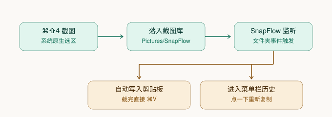

# SnapFlow · 截图中枢

**把 macOS 的截图流程改造成 Windows 的样子** —— 截完图直接在剪贴板里，随时 `⌘V`；旧截图有历史可查，不用翻文件夹、不用手动删。

菜单栏常驻的原生小工具。**零依赖、零系统权限、无网络请求、无遥测。**




---

## 它解决了什么

macOS 的截图默认行为很不顺手：右下角弹一个浮动的缩略图停一会，然后图片默默堆到桌面或「下载」里。等你下次想用它，得「选取文件 → 在文件夹里翻 → 用完再想删」。

| 原来的痛点 | 用了 SnapFlow |
|---|---|
| 截图后右下角弹缩略图，停一会才消失 | 浮动缩略图已关闭，截完就是截完了 |
| 截图堆在「下载」/桌面，越来越乱 | 落到专用图库 `~/Pictures/SnapFlow`，不再污染其它目录 |
| 复用旧截图要翻文件夹 | 点菜单栏图标，最近截图缩略图墙直接看，**点一下就重新复制** |
| 用完还得手动清理 | 超出保留数量的旧图自动进**废纸篓（可恢复）**，也能一键清空 |

---

## 安装

需要 macOS 13+ 和 Xcode Command Line Tools（`xcode-select --install`，**不需要完整 Xcode**）。

```bash
git clone https://github.com/Harrrrvey/SnapFlow.git
cd SnapFlow
bash install.sh
```

`install.sh` 会做四件事：

1. 编译并安装 `~/Applications/SnapFlow.app`
2. 把系统截图保存位置改到 `~/Pictures/SnapFlow`
3. 关闭右下角浮动缩略图
4. 注册开机自启（`~/Library/LaunchAgents/io.haoren.snapflow.plist`）

跑完菜单栏右上角会出现一个相机取景框图标。

---

## 日常用法

| 操作 | 效果 |
|---|---|
| `⌘⇧3` / `⌘⇧4` / `⌘⇧5` | 和以前一样截图（全屏 / 区域 / 窗口），只是不再弹缩略图 |
| 截完直接 `⌘V` | 图片已经在剪贴板里了，不需要任何多余操作 |
| 点菜单栏图标 | 打开历史面板 —— 最近截图的缩略图墙 |
| 缩略图上单击 | 重新复制到剪贴板 |
| 悬停缩略图 | 出现「复制 / 删除」两个按钮 |
| 右键缩略图 | 复制到剪贴板 / 在访达中显示 / 移到废纸篓 |
| 右键菜单栏图标 | 打开图库 / 更改图库位置 / 退出 |

---

## 设置项

点面板右上角的滑杆图标：

- **截图后自动复制到剪贴板** — 默认开。关掉后截图只入库、不进剪贴板
- **显示提示浮层** — 默认开。右下角 1.6 秒的提示，不抢焦点、不挡鼠标
- **自动清理旧截图** — 默认开。超出保留数量的旧图**移到废纸篓**，不是直接抹掉
- **保留最近 N 张** — 默认 40，可调 5～500
- **图库位置** — 可改到任意文件夹
- **恢复 macOS 默认截图设置** — 一键还原

---

## 卸载

```bash
cd SnapFlow && bash uninstall.sh
```

移除 App 与自启项、还原系统截图设置。**不会删除你的截图**，图库会留在原位。

---

## 设计取舍

这个工具最核心的一个决定是：**SnapFlow 不自己截图**。

它只监视图库文件夹（`DispatchSource` 文件系统事件 + 4 秒兜底轮询），截图这件事仍然交给 macOS 原生完成。这个取舍换来两件事：

- **不需要「屏幕录制」权限** —— 少一个授权弹窗，也少一份隐私顾虑
- **不需要「辅助功能」权限** —— 它只**写入**剪贴板（`NSPasteboard.setData`），从不读取。macOS 15+ 的剪贴板隐私弹窗只针对「读取」行为，所以它永远不会弹窗

另外：

- 剪贴板里同时写入 **PNG + TIFF + 文件 URL** 三种格式 —— 粘到微信/PS 得到图片，粘到访达/终端得到文件本身
- 所有删除操作一律走 `FileManager.trashItem`，**进废纸篓可恢复**，绝不直接 unlink
- 菜单栏应用（`LSUIElement`），没有 Dock 图标

---

## 为什么不用现成的开源项目

动手前把 GitHub 翻了一遍，没有精准匹配的：

| 项目 | Stars | 为什么不合适 |
|---|---|---|
| [Maccy](https://github.com/p0deje/Maccy) | 21.8k | 通用剪贴板管理器，不感知截图工作流 |
| [eSearch](https://github.com/xushengfeng/eSearch) | 7.3k | Electron 重型套件（OCR / 翻译 / 录屏），杀鸡用牛刀 |
| [capcap](https://github.com/realskyrin/capcap) | 956 | 另一套截图工具，形态完全不同 |
| [DodoShot](https://github.com/DodoApps/dodoshot) / [OneShot](https://github.com/GrantBirki/oneshot) / [ScreenCap](https://github.com/8tp/ScreenCap) | 42 / 7 / 4 | 太新、无社区验证，且需要 Xcode 工程构建 |

需求是「截图直进剪贴板 + 历史一键复用 + 零文件管理」，于是写了一个。

---

## 常见问题

**截图还是落在桌面 / 下载里？**
改完系统截图设置需要菜单栏重启一次才生效。`install.sh` 里已经包含了，如果仍然不对就手动执行：

```bash
killall SystemUIServer
```

**想手动改系统截图设置？**

```bash
defaults read com.apple.screencapture                              # 查看当前
defaults write com.apple.screencapture location ~/Pictures/SnapFlow
defaults write com.apple.screencapture show-thumbnail -bool false
killall SystemUIServer
```

**它在后台做什么？会联网吗？**
不联网，没有任何网络代码。它做的事只有三件：看一个文件夹、往剪贴板写数据、在必要的时候把文件移到废纸篓。日志写在 `~/Library/Logs/SnapFlow.log`（超过 512 KB 自动重写）。

---

## 目录结构

```
SnapFlow/
├── Sources/
│   ├── main.swift          程序入口
│   ├── Store.swift         图库监视、剪贴板写入、清理逻辑
│   ├── AppDelegate.swift   菜单栏图标与弹出面板
│   ├── PanelView.swift     历史面板 UI（SwiftUI）
│   ├── HUD.swift           右下角提示浮层
│   └── Log.swift           滚动日志
├── Resources/Info.plist    Bundle 配置（LSUIElement，无 Dock 图标）
├── assets/workflow.svg     流程图
├── build.sh                编译（只需 Command Line Tools）
├── install.sh              一键安装
├── uninstall.sh            一键卸载
└── LICENSE
```

改代码后重新编译并运行：

```bash
bash build.sh && open build/SnapFlow.app
```

> 从 `build/` 直接运行的是开发版本，不会开机自启。正式安装请用 `install.sh`。

---

## English

**SnapFlow** is a tiny native macOS menu-bar app that makes screenshots behave the way they do on Windows: after `⌘⇧4`, the image is **already in your clipboard** — no floating thumbnail, no file piling up in Downloads. Recent shots live in a menu-bar history you can click to re-copy, and old ones are auto-moved to Trash (recoverable).

It requires **no permissions at all**: it never captures the screen itself (it just watches a folder), and it only *writes* to the clipboard, never reads it.

MIT licensed.

---

## License

[MIT](LICENSE) © 2026 PAN Haoren
